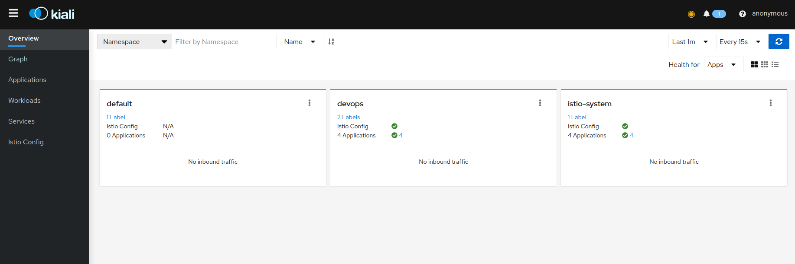
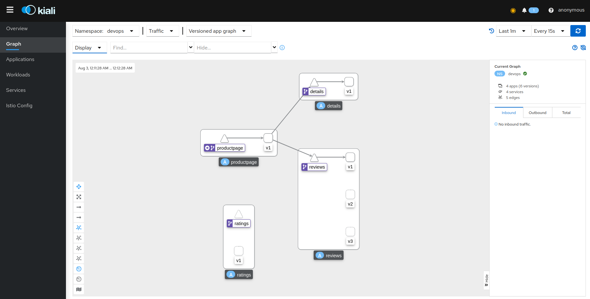

## Staring the KIALI dashboard and using for various things

* first check that the prometheus and kiali pods are up
```bash
$ kubectl get pods -n istio-system
NAME                                    READY   STATUS    RESTARTS   AGE
istio-ingressgateway-5f86977657-cqv56   1/1     Running   0          77m
istiod-7587989b4f-6s9w5                 1/1     Running   0          78m
kiali-575cc8cbf-9qj6b                   1/1     Running   0          7m48s
prometheus-6544454f65-nm65s             2/2     Running   0          7m47s
```
* Now active the kiali dashboard using 

  * either in this way
  ```bash
  $ kubectl port-forward svc/kiali -n istio-system 20001:20001
  Forwarding from 127.0.0.1:20001 -> 20001
  Forwarding from [::1]:20001 -> 20001
  ```
  * Or in this way
  ```bash
  $ istioctl dashboard kiali
  http://localhost:20001/kiali
  ```
  * you may see similar output on browser
  


* Now we see the graph of whole cluster working
  * click on **Graph** on side navigation pane.
  * Select *devops* in Namespace
  * In Traffic, let default config be there
  * Select Versioned Graph
  * In Display, select *Traffic Distribution, Traffic Rate, Idle Edges, Idle Nodes, Service Nodes, Traffic Animation* and rest whatever is selected beforehand.
  * Click on Create graph for idle edges in middle of graph dashboard.
  You may see similar output
  



* We need to create traffic so we run the following command to create the traffic
```bash
$ watch  exec curl -s -o /dev/null "http://$GATEWAY_URL/productpage"

```

 * Now you can see the traffic with animation


### Traffic Management : Traffic Shifting

The Traffic Shifting Wizard allows selecting the percentage of traffic that is routed to a specific workload.

* Since it only moving to verision 1 we want it to move to all in equal way for that we change the traffic rules

  * we will select reviews and on side comes the info bar wher we click on reviews


  * Now we see current traffic route and again click on reviews


  * Now we will delete this traffic route click on *Actions* on right side of dashboard. Select *Delete Traffic Routing*.


  * Confirm the delete of virtual service and destination rule


  * Create New Traffic route using *Traffic Shifting* in *Actions*.
  * It can used to redirect the traffic as we want by providing the weightage. We will be using equal proportions here. In advance setting s you can change the destination, like here we use the DNS for *reviews* in gateway the the istio gateway is used. Similarly in *Traffic Policy* you can configure *TLS* configurations, *Loadbalancer*, etc. In circuit breaker you can edit Connection setup like max connections or HTTPS Max pending Requests.
  * Click on **Preview**


  * Now you can see the yaml files created new virtual service and destination rule.
  * Click on **Create**


  * A new Route is created


  * See it in graph with previous configurations


**NOTE:** All the other use cases are applied in similar ways so skipping the basic start part

### Traffic Management: Fault Injection

The Fault Injection Wizard allows injecting faults to test the resiliency of a Service.

    HTTP Delay specification is used to inject latency into the request forwarding path.
    HTTP Abort specification is used to immediately abort a request and return a pre-specified status code.


### Traffic Management: Requests Routing

The Request Routing Wizard allows creating multiple routing rules.

  * Every rule is composed of a Request Matching and a Routes To section.
  * The Request Matching section can add multiple filters using HEADERS, URI, SCHEME, METHOD or AUTHORITY HTTP parameters.
  * The Request Matching section can be empty, in this case any HTTP request received is matched against this rule.
  * The Routes To section can specify the percentage of traffic that is routed to a specific workload.


Istio applies routing rules in order, meaning that the first rule matching an HTTP request (top-down) performs the routing. The Matching Routing Wizard allows changing the rule order.

### Traffic Management: Request Timeouts

The Request Timeouts Wizard sets up request timeouts in Envoy, using Istio.

  * HTTP Timeout defines the timeout for a request.
  * HTTP Retry describes the retry policy to use when an HTTP request fails.


### Traffic Management: Gateways

Traffic Management Wizards have an Advanced Options section that can be used to extend the scenario.

One available Advanced Option is to expose a Service to external traffic through an existing Gateway or to create a new Gateway for this Service.


### Traffic Management: Circuit Breaker

Traffic Management Wizards allows defining Circuit Breakers on Services as part of the available Advanced Options.

  * Connection Pool defines the connection limits for an upstream host.
  * Outlier Detection implements the Circuit Breaker based on the consecutive errors reported.


### Security: Traffic Policy

Traffic Management Advanced Options allows defining Security and Load Balancing settings.

  * TLS related settings for connections to the upstream service.
  * Automatically generate a PeerAuthentication resource for this Service.
  * Load balancing policies to apply for a specific destination.


_______________________________________________________________________________________________________________________________________________________________


